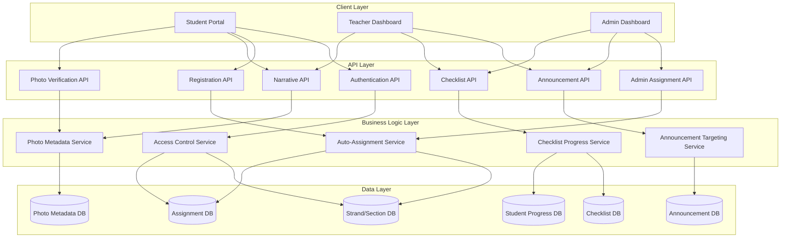
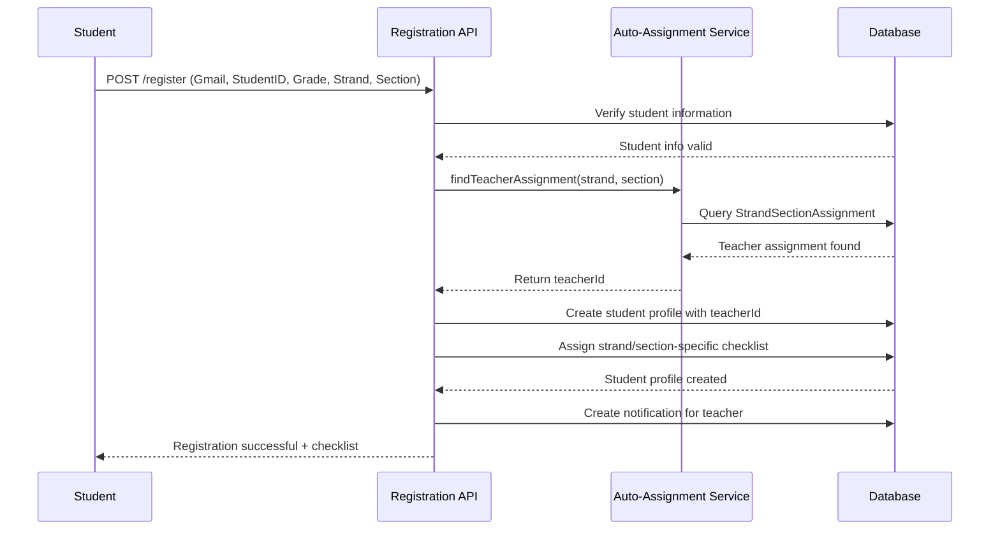
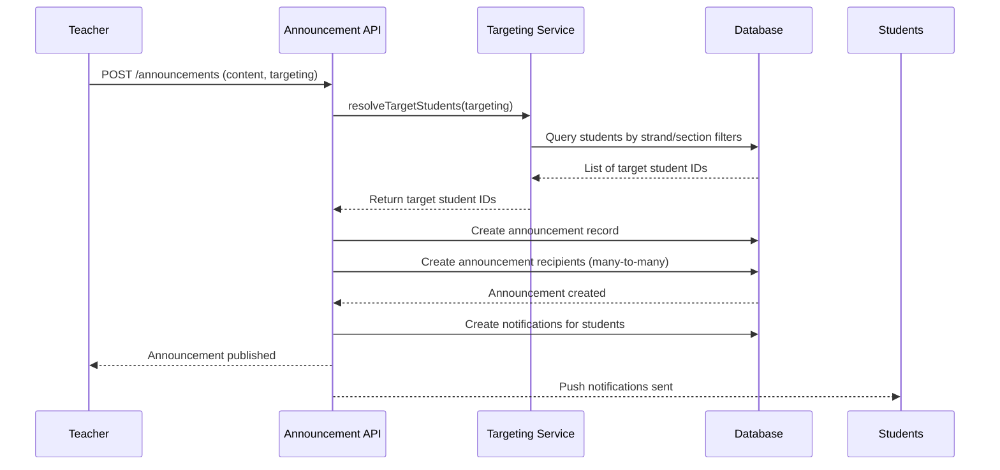
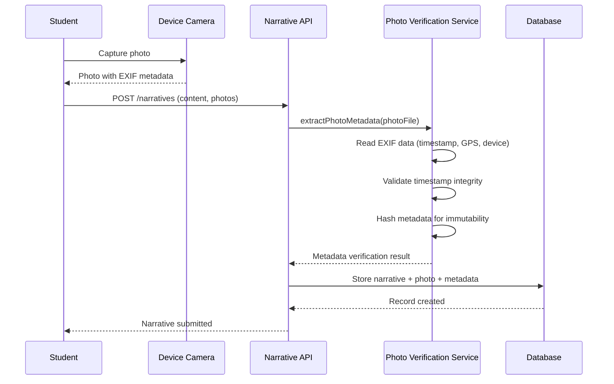

# Design Document: Advanced Work Immersion Management System

## Overview

The Advanced Work Immersion Management System enhances the existing platform with robust strand/section management, automatic administrator assignment, targeted announcements, dynamic checklist management, and camera timestamp verification. This system addresses the need for organized student grouping, automated administrative workflows, and verifiable narrative submissions with photo evidence.

The core enhancement revolves around the Strand-Section-Teacher relationship model where each strand-section combination has exactly one assigned teacher/administrator. Students register by selecting their grade level, strand, and section, which automatically assigns them to the appropriate teacher. Teachers manage only their assigned students, while the main administrator has system-wide access. The system includes targeted announcements filtered by strand/section, dynamic requirement checklists that update based on actual submissions, and photo metadata verification to prevent timestamp manipulation.

## Architecture



## Sequence Diagrams

### Student Registration with Auto-Assignment



### Targeted Announcement Creation



### Photo Timestamp Verification



## Components and Interfaces

### Component 1: Strand/Section Management Service


**Purpose**: Manages the creation, modification, and retrieval of strands, sections, and their assignments to teachers.

**Interface**:
```typescript
interface IStrandSectionService {
  createStrand(data: StrandCreateInput): Promise<Strand>
  createSection(data: SectionCreateInput): Promise<Section>
  assignTeacherToStrandSection(
    strandId: string,
    sectionId: string,
    teacherId: string
  ): Promise<StrandSectionAssignment>
  getAvailableStrands(): Promise<Strand[]>
  getAvailableSections(gradeLevel: number): Promise<Section[]>
  getTeacherAssignment(
    strandId: string,
    sectionId: string
  ): Promise<Teacher | null>
  validateStrandSectionCombination(
    strandId: string,
    sectionId: string
  ): Promise<boolean>
}

type StrandCreateInput = {
  name: string
  code: string
  description?: string
}

type SectionCreateInput = {
  name: string
  gradeLevel: number
  capacity?: number
}
```

**Responsibilities**:
- CRUD operations for strands and sections
- Teacher assignment to strand-section combinations
- Validation of strand-section relationships
- Ensuring one teacher per strand-section combination


### Component 2: Auto-Assignment Service

**Purpose**: Automatically identifies and assigns the correct teacher to a student based on their selected strand and section during registration.

**Interface**:
```typescript
interface IAutoAssignmentService {
  assignTeacherToStudent(
    studentId: string,
    strandId: string,
    sectionId: string
  ): Promise<AssignmentResult>
  getStudentsByTeacher(
    teacherId: string,
    filters?: StudentFilter
  ): Promise<Student[]>
  reassignStudent(
    studentId: string,
    newStrandId: string,
    newSectionId: string
  ): Promise<AssignmentResult>
}

type AssignmentResult = {
  success: boolean
  teacherId: string | null
  teacherName: string | null
  error?: string
}

type StudentFilter = {
  strandId?: string
  sectionId?: string
  status?: string
}
```

**Responsibilities**:
- Query strand-section-teacher assignments
- Automatically assign teacher to student during registration
- Handle reassignment scenarios
- Validate teacher availability


### Component 3: Announcement Targeting Service

**Purpose**: Manages creation and delivery of targeted announcements to specific student groups based on strand, section, or combination.

**Interface**:
```typescript
interface IAnnouncementService {
  createAnnouncement(data: AnnouncementCreateInput): Promise<Announcement>
  resolveTargetStudents(targeting: TargetingCriteria): Promise<string[]>
  getAnnouncementsForStudent(studentId: string): Promise<Announcement[]>
  getAnnouncementsByTeacher(
    teacherId: string,
    filters?: AnnouncementFilter
  ): Promise<Announcement[]>
  markAnnouncementAsRead(
    studentId: string,
    announcementId: string
  ): Promise<void>
}

type AnnouncementCreateInput = {
  teacherId: string
  title: string
  content: string
  type: AnnouncementType
  targeting: TargetingCriteria
  attachments?: AttachmentInput[]
}

type TargetingCriteria = {
  targetType: 'all' | 'strand' | 'section' | 'strand_section'
  strandId?: string
  sectionId?: string
}

type AnnouncementType = 
  | 'reminder'
  | 'deadline'
  | 'schedule_change'
  | 'instruction'
  | 'meeting'
  | 'document'
  | 'orientation'
  | 'workplace_update'
  | 'emergency'


type AnnouncementFilter = {
  type?: AnnouncementType
  startDate?: Date
  endDate?: Date
}
```

**Responsibilities**:
- Create announcements with targeting criteria
- Resolve target student lists based on strand/section filters
- Deliver announcements to appropriate students
- Track read/unread status per student
- Support attachment handling

### Component 4: Checklist Management Service

**Purpose**: Manages dynamic, strand/section-specific requirement checklists and tracks student progress automatically based on submissions.

**Interface**:
```typescript
interface IChecklistService {
  createChecklistTemplate(data: ChecklistTemplateInput): Promise<ChecklistTemplate>
  assignChecklistToStudent(
    studentId: string,
    templateId: string
  ): Promise<StudentChecklist>
  getStudentChecklist(studentId: string): Promise<StudentChecklistWithProgress>
  updateChecklistItemStatus(
    studentId: string,
    itemId: string,
    status: ChecklistItemStatus
  ): Promise<void>
  autoUpdateChecklistFromSubmission(
    studentId: string,
    submissionType: string
  ): Promise<void>
  getChecklistProgress(studentId: string): Promise<ChecklistProgress>
}


type ChecklistTemplateInput = {
  name: string
  strandId?: string
  sectionId?: string
  items: ChecklistItemInput[]
}

type ChecklistItemInput = {
  title: string
  description?: string
  type: ChecklistItemType
  order: number
  required: boolean
}

type ChecklistItemType = 
  | 'orientation'
  | 'consent_form'
  | 'medical_requirement'
  | 'resume'
  | 'application_letter'
  | 'company_assignment'
  | 'daily_log'
  | 'narrative_report'
  | 'portfolio'
  | 'final_evaluation'

type ChecklistItemStatus = 'pending' | 'submitted' | 'completed'

type ChecklistProgress = {
  total: number
  completed: number
  submitted: number
  pending: number
  percentComplete: number
}
```

**Responsibilities**:
- Create strand/section-specific checklist templates
- Assign checklists to students during registration
- Track student progress on checklist items
- Auto-update status based on document submissions
- Calculate progress metrics


### Component 5: Photo Metadata Verification Service

**Purpose**: Extracts, validates, and stores immutable photo metadata to prevent timestamp manipulation and ensure narrative submission authenticity.

**Interface**:
```typescript
interface IPhotoVerificationService {
  extractMetadata(photoFile: File): Promise<PhotoMetadata>
  validateTimestamp(metadata: PhotoMetadata): Promise<TimestampValidation>
  storeMetadata(
    narrativeId: string,
    photoId: string,
    metadata: PhotoMetadata
  ): Promise<void>
  verifyPhotoAuthenticity(photoId: string): Promise<AuthenticityResult>
  getPhotoMetadata(photoId: string): Promise<PhotoMetadata>
}

type PhotoMetadata = {
  captureTimestamp: Date
  deviceInfo: DeviceInfo
  gpsLocation?: GPSCoordinates
  cameraSettings: CameraSettings
  exifData: Record<string, any>
  metadataHash: string
}

type DeviceInfo = {
  make?: string
  model?: string
  osVersion?: string
  appVersion?: string
}

type GPSCoordinates = {
  latitude: number
  longitude: number
  altitude?: number
  accuracy?: number
}


type CameraSettings = {
  iso?: number
  aperture?: string
  shutterSpeed?: string
  flash?: string
}

type TimestampValidation = {
  isValid: boolean
  captureTime: Date
  submissionTime: Date
  timeDifference: number
  warnings: string[]
}

type AuthenticityResult = {
  isAuthentic: boolean
  confidence: number
  flags: string[]
}
```

**Responsibilities**:
- Extract EXIF metadata from uploaded photos
- Validate timestamp integrity and authenticity
- Store immutable metadata with cryptographic hash
- Detect timestamp manipulation attempts
- Provide GPS location verification (optional)

### Component 6: Access Control Service

**Purpose**: Enforces role-based access control ensuring teachers only access their assigned strand/section students while main admin has full access.

**Interface**:
```typescript
interface IAccessControlService {
  canTeacherAccessStudent(
    teacherId: string,
    studentId: string
  ): Promise<boolean>
  getAccessibleStudents(teacherId: string): Promise<string[]>
  canCreateAnnouncement(
    teacherId: string,
    targeting: TargetingCriteria
  ): Promise<boolean>
  validateStrandSectionAccess(
    teacherId: string,
    strandId: string,
    sectionId: string
  ): Promise<boolean>
  isMainAdministrator(userId: string): Promise<boolean>
}
```

**Responsibilities**:
- Verify teacher-student relationship based on strand/section
- Filter accessible resources based on user role
- Validate announcement targeting permissions
- Distinguish between regular teachers and main administrator

## Data Models

### Model 1: Strand

```typescript
interface Strand {
  id: string
  name: string // "ICT", "STEM", "ABM", "HUMSS"
  code: string // "ICT", "STEM", "ABM", "HUMSS"
  description?: string
  isActive: boolean
  createdAt: Date
  updatedAt: Date
  
  // Relations
  assignments: StrandSectionAssignment[]
  students: Student[]
}
```

**Validation Rules**:
- `name` must be non-empty string, max 100 characters
- `code` must be unique, uppercase, max 20 characters
- `isActive` defaults to true
- Cannot delete strand if students are assigned

### Model 2: Section

```typescript
interface Section {
  id: string
  name: string // "12-A", "12-B", "11-C"
  gradeLevel: number // 11 or 12
  capacity?: number
  isActive: boolean
  createdAt: Date
  updatedAt: Date
  
  // Relations
  assignments: StrandSectionAssignment[]
  students: Student[]
}
```


**Validation Rules**:
- `name` must be non-empty string, max 50 characters
- `gradeLevel` must be 11 or 12
- `capacity` if specified must be positive integer
- `isActive` defaults to true
- Cannot delete section if students are assigned

### Model 3: StrandSectionAssignment

```typescript
interface StrandSectionAssignment {
  id: string
  strandId: string
  sectionId: string
  teacherId: string
  isActive: boolean
  createdAt: Date
  updatedAt: Date
  
  // Relations
  strand: Strand
  section: Section
  teacher: Teacher
}
```

**Validation Rules**:
- Composite unique constraint on (strandId, sectionId)
- `teacherId` must reference valid Teacher
- `strandId` must reference valid Strand
- `sectionId` must reference valid Section
- Only one active assignment per strand-section combination
- Cannot delete if students are assigned

### Model 4: Student (Enhanced)

```typescript
interface Student {
  id: string
  studentId: string
  name: string
  email: string
  gradeLevel: number
  strandId: string
  sectionId: string
  supervisorId: string // Auto-assigned teacher
  company?: string
  createdAt: Date
  updatedAt: Date
  
  // Relations
  strand: Strand
  section: Section
  supervisor: Teacher
  narratives: Narrative[]
  checklist: StudentChecklist
  announcementReads: AnnouncementRead[]
}
```


**Validation Rules**:
- `studentId` must be unique
- `email` must be unique and valid Gmail format
- `gradeLevel` must be 11 or 12
- `strandId` and `sectionId` must form valid combination
- `supervisorId` must be auto-assigned from StrandSectionAssignment
- Cannot manually set `supervisorId` during registration

### Model 5: Teacher (Enhanced)

```typescript
interface Teacher {
  id: string
  teacherId: string
  name: string
  email: string
  password?: string
  role: 'teacher' | 'admin'
  isMainAdmin: boolean
  createdAt: Date
  updatedAt: Date
  
  // Relations
  assignments: StrandSectionAssignment[]
  students: Student[]
  announcements: Announcement[]
  narrativeReviews: NarrativeReview[]
  notifications: Notification[]
}
```

**Validation Rules**:
- `teacherId` must be unique
- `email` must be unique
- `role` must be 'teacher' or 'admin'
- `isMainAdmin` defaults to false
- Only one teacher can have `isMainAdmin = true`
- Main admin can access all strands/sections

### Model 6: Announcement

```typescript
interface Announcement {
  id: string
  teacherId: string
  title: string
  content: string
  type: AnnouncementType
  targetType: 'all' | 'strand' | 'section' | 'strand_section'
  strandId?: string
  sectionId?: string
  attachments: Attachment[]
  createdAt: Date
  updatedAt: Date
  
  // Relations
  teacher: Teacher
  strand?: Strand
  section?: Section
  reads: AnnouncementRead[]
}
```


**Validation Rules**:
- `title` must be non-empty, max 200 characters
- `content` must be non-empty, max 5000 characters
- `type` must be valid AnnouncementType
- `targetType` must be one of: 'all', 'strand', 'section', 'strand_section'
- If `targetType` is 'strand', `strandId` must be set
- If `targetType` is 'section', `sectionId` must be set
- If `targetType` is 'strand_section', both `strandId` and `sectionId` must be set
- Teacher can only target their assigned strand/section (unless main admin)

### Model 7: AnnouncementRead

```typescript
interface AnnouncementRead {
  id: string
  announcementId: string
  studentId: string
  readAt: Date
  
  // Relations
  announcement: Announcement
  student: Student
}
```

**Validation Rules**:
- Composite unique constraint on (announcementId, studentId)
- `readAt` defaults to current timestamp
- Cannot create duplicate read records

### Model 8: ChecklistTemplate

```typescript
interface ChecklistTemplate {
  id: string
  name: string
  description?: string
  strandId?: string
  sectionId?: string
  isDefault: boolean
  createdAt: Date
  updatedAt: Date
  
  // Relations
  strand?: Strand
  section?: Section
  items: ChecklistItem[]
  studentChecklists: StudentChecklist[]
}
```


**Validation Rules**:
- `name` must be non-empty, max 200 characters
- If `strandId` is set, template applies to that strand
- If `sectionId` is set, template applies to that section
- If both set, template applies to strand-section combination
- Only one template can be `isDefault = true` per strand/section
- Must have at least one ChecklistItem

### Model 9: ChecklistItem

```typescript
interface ChecklistItem {
  id: string
  templateId: string
  title: string
  description?: string
  type: ChecklistItemType
  order: number
  required: boolean
  createdAt: Date
  updatedAt: Date
  
  // Relations
  template: ChecklistTemplate
  studentProgress: StudentChecklistProgress[]
}
```

**Validation Rules**:
- `title` must be non-empty, max 200 characters
- `type` must be valid ChecklistItemType
- `order` must be non-negative integer
- `required` defaults to true
- Cannot delete item if students have progress records

### Model 10: StudentChecklist

```typescript
interface StudentChecklist {
  id: string
  studentId: string
  templateId: string
  assignedAt: Date
  
  // Relations
  student: Student
  template: ChecklistTemplate
  progress: StudentChecklistProgress[]
}
```
